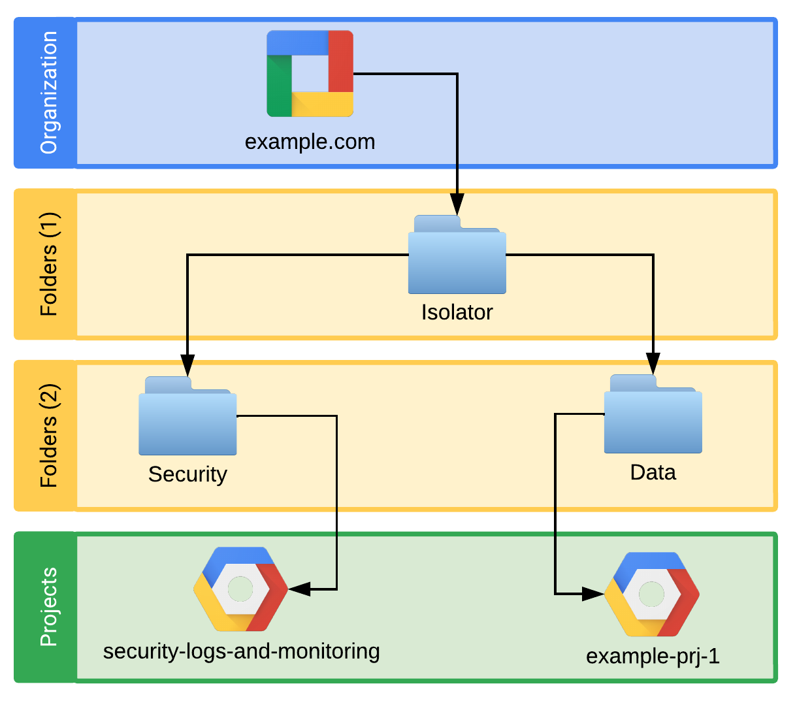
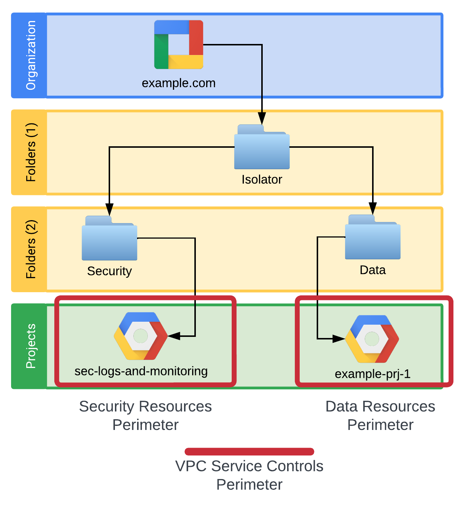
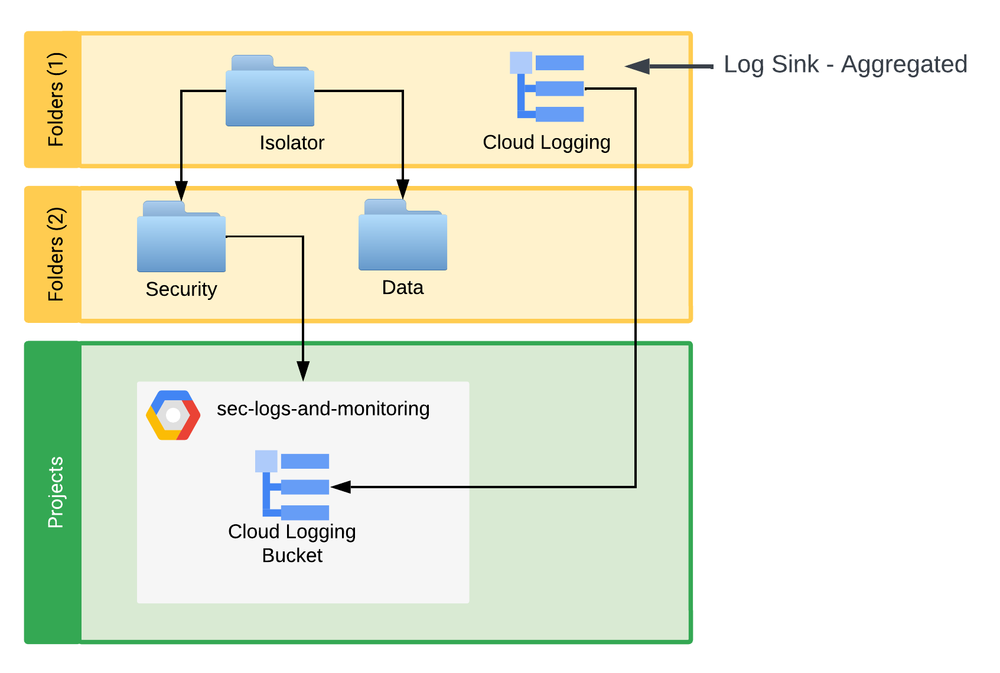
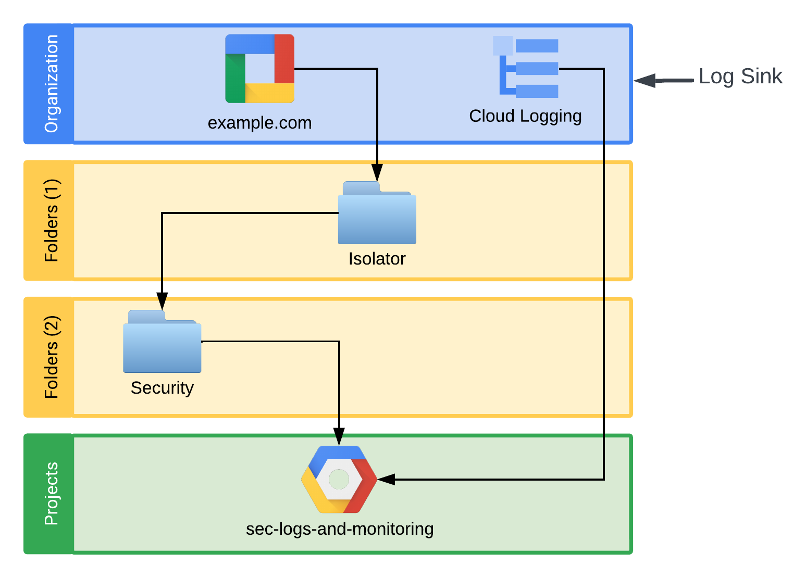

Copyright 2024 The Isolator Authors

Licensed under the Apache License, Version 2.0 (the "License");
you may not use this file except in compliance with the License.
You may obtain a copy of the License at

http://www.apache.org/licenses/LICENSE-2.0

Unless required by applicable law or agreed to in writing, software
distributed under the License is distributed on an "AS IS" BASIS,
WITHOUT WARRANTIES OR CONDITIONS OF ANY KIND, either express or implied.
See the License for the specific language governing permissions and
limitations under the License.

# Table of Contents

* [Isolator Personas](#isolator-personas)
* [A Note on Alerting](#a-note-on-alerting)
* [Personas Required to Operate Isolator](#personas-required-to-operate-isolator)
* [Cloud Identity (Admin Console)](#cloud-identity-admin-console)
    * [Workspace](#workspace)
    * [Additional Google Services](#additional-google-services)
    * [Disable Cloud Shell](#disable-cloud-shell)
    * [Configure Cloud Session Length](#configure-cloud-session-length)
    * [Configure 3rd Party OAuth for Cloud Identity](#configure-3rd-party-oauth-for-cloud-identity)
* [Devices](#devices)
    * [Chrome Policies](#chrome-policies)
    * [Endpoint Verification (part of Chrome Enterprise Premium)](#endpoint-verification-part-of-chrome-enterprise-premium)
    * [Licensing](#licensing)
    * [Chrome Enterprise Premium](#chrome-enterprise-premium)
* [Alerting](#alerting)
* [Resource Manager](#resource-manager)
    * [Organizational Policies](#organizational-policies)
* [Logging](#logging)
    * [Access Transparency Logs](#access-transparency-logs)
    * [Data Access Logs](#data-access-logs)
* [VPC (Networking)](#vpc-networking)
    * [Routing](#routing)
    * [DNS](#dns)
        * [Google APIs](#google-apis)
        * [Cloud Functions](#cloud-functions)
        * [GCR IO (Artifact Registry)](#gcr-io-artifact-registry)
        * [PKG Dev (Artifact Registry)](#pkg-dev-artifact-registry)
        * [Cloud Run](#cloud-run)
        * [Google.com](#google.com)
        * [PKI](#pki)
    * [IPv4 & IPv6](#ipv4--ipv6)
    * [Hierarchical Firewall Rules](#hierarchical-firewall-rules)
* [VPC Service Controls](#vpc-service-controls)
* [Security Services Resources](#security-services-resources)
    * [Log Sinks](#log-sinks)
        * [Isolator Folder Log Sink - Platform Logs](#isolator-folder-log-sink---platform-logs)
        * [Isolator Folder Log Sink - Data Access Logs](#isolator-folder-log-sink---data-access-logs)
        * [Isolator Org Node Log Sink](#isolator-org-node-log-sink)
    * [Log Monitoring](#log-monitoring)
* [Infrastructure as Code Pipelines](#infrastructure-as-code-pipelines)
    * [Overview](#overview)
    * [Service Accounts](#service-accounts)
    * [Security Code Changes - Review & Approval](#security-code-changes---review--approval)

**This is not an officially supported Google product**

# Isolator Personas

As Isolator is intended for collaboration between two organizations, the
personas will be referenced in two ways:

1. **Isolator Host**

   The host organization is the organization which will create the Isolator
   resources and host identities and the Google Cloud resources for Isolator.
   This is typically the organization which has the sensitive data and wishes
   other organizations and partners to come into their environment to build
   solutions.

2. **Isolator Partner(s)**

   The partner(s) organization is the organization which will work with the host
   organization to develop and collaborate on use cases. The partner
   organization will use the identities, devices, and Google Cloud resources
   provided by the host organization.

***

**A note on alerting:**

Isolator comes with recommended security alerts to notify both the Isolator Host
and Isolator Partner(s) to changes in the security posture of the Isolator
environment. The purpose of these alerts are to help ensure that both parties
are aware of potentially unwanted security control changes. Without these alerts
the Partner(s) are unable to verify the security posture of Isolator and thus
could be operating at risk. The alerts generated and identified by Isolator are
for these posture notification purposes only, they are not intended to replace
the Isolator Host organization’s security alerting and incident response.

Isolator generated alerts <u>**are not**</u> a replacement for an organization's
security
monitoring and alerting in Google Cloud.

***

Below are the personas required to operate Isolator.

1. **Isolator Host - Security Administration Team**
   This team is responsible for the overall security of the Isolator environment
   and is responsible for security monitoring, alerting, and response. This team
   is
   responsible for security incident response.
   This team is responsible for the deployment of Google Cloud foundational
   security controls and Isolator security controls.
   This team is responsible for jointly maintaining the Isolator security
   controls
   with the Isolator Partner Security Administration Team.

2. **Isolator Partner - Security Administration Team**
   This team is responsible for jointly maintaining the security controls and
   monitoring of the Isolator security environment with the Isolator Partner
   Security Administration Team.
   This team is responsible for working with the Host Isolator Security
   Administration team to address alerts generated by the Isolator environment

***

# Cloud Identity (Admin Console)

The Isolator environment requires a unique OU within the Isolator Host
organization Cloud Identity environment. This allows the team configuring and
managing the Isolator to deploy specific security policies, issue licensing, and
scope alerting.
This new OU should still have groups and group membership sourced from Isolator
Host organization central Identity Provider (IdP) using the same process the
Isolator Host organization currently uses to provision users and groups as well
as user authentication settings (e.g. SSO).
In the Isolator specific OU created, most Google Services (e.g. gmail, docs,
etc.) are disabled. The only Google services which are enabled are: Google Cloud
Platform, Google Chrome Sync, and Google Developers

## Workspace

No Workspace services are required for Isolator. Please note, if the Isolator
Host organization uses Google Workspace then team members may end up using
Google Workspace for general collaboration between Isolator Host and Isolator
Partner(s). In those instances, it is treated the same as any other productivity
tool used by the team while working with the Isolator Host organization and is
not considered a part of Isolator.

## Additional Google Services

The following services under Apps>Additional Google Services are to be turned
“ON” all other services must be turned “OFF”:

* Chrome Enterprise Security Services
* Google Cloud Platform

## Disable Cloud Shell

Cloud Shell does not provide the necessary security controls Isolator requires
and will be blocked by default by Isolator security controls (specifically VPC
Service Controls). Therefore to enable a better developer experience Isolator
disables the use of Cloud Shell. (for more information: [Disable Cloud
Shell](https://cloud.google.com/shell/docs/resetting-cloud-shell)).

## Configure Cloud Session Length

Isolator requires
the [configuration of session length for Google Cloud](https://support.google.com/a/answer/9368756)
Session length: 24 hours
Reauthentication method: Password

## Configure 3rd Party OAuth for Cloud Identity

3rd Party OAuth for Cloud Identity is a domain wide setting, which means it
cannot be configured to solely apply to Isolator. Therefore, Isolator only
requires the Isolator Host organization to review these settings and confirm
they are configured to the desired state. Please
see [here](https://support.google.com/cloudidentity/answer/7281227?hl=en) for
more information.

## Devices

Isolator requires the Isolator Host organization to provide a managed device
which can install Chrome browser and allow Isolator to set necessary
configurations for that browser. The device can be a laptop, VDI, or other
solution.

Note, a requirement of Isolator is that users may only access the Google Cloud
Isolator environment if they are accessing from a Isolator Host organization
managed device. Therefore, it is required that the Isolator Host organization
verify a device. This configuration will be done via Cloud Identity and may use
either the device serial number or a certificate.
See [here](https://support.google.com/a/answer/11368990#zippy=%2Callow-access-to-company-owned-devices)
for additional
information about configuration.
See [here](https://support.google.com/a/answer/9560715#zippy=%2Cendpoint-verification)
for what information is provided via
[Endpoint Verification](https://docs.google.com/document/d/1FuBuWaFMbQ5NGUBUcjtlmXkglIc49Ytao5tuvpyoMJc/edit?resourcekey=0--G35tFpYFX8hzr0KtPrcIw&tab=t.0#heading=h.47t792uwfvlf).

Isolator Host organizations will be required to confirm their device is corp
owned.
See [here](https://apps.google.com/supportwidget/articlehome?hl=en&article_url=https%3A%2F%2Fsupport.google.com%2Fa%2Fanswer%2F7129612%3Fhl%3Den&assistant_event=welcome&assistant_id=mdmbot&product_context=7129612&product_name=UnuFlow&trigger_context=a)
for additional details.

In addition to these requirements, the customer is also required to block the
ability to install the gcloud SDk on these devices. Each customer may have their
own capability to block this ability so specific configurations will not be
listed, only the requirement to block the ability to install/use it.

***

## Chrome Policies

Isolator defines specific Chrome policies that will be managed by Chrome Browser
Cloud Management (CBCM). The following Chrome policies applied to the **Isolator
OU** under the “User & browser settings” within Cloud Identity. Specifically:
Devices > Chrome > Settings > User & browser settings

* **Sign-In settings**
    * Separate profile for managed Google Identity
        * Force separate profile and forbid secondary managed accounts
    * Managed account as secondary account
        * Block addition of a managed account as secondary account (in-session)
* **Security**
    * Password manager
        * Never allow use of password manager
    * Incognito mode
        * Disallow incognito mode
    * Allow remote debugging
        * Do not allow use of the remote debugging
* **Network**
    * Minimum SSL version enabled
        * TLS 1.2
* **Content**
    * Screenshot
        * Do not allow users to take screenshots or video recordings
    * Screen video capture
        * Do not allow sites to prompt user to share a video stream of their
          screen
    * Clipboard
        * Do not allow any site to use the clipboard site permission
    * Cast
        * Do not allow users to Cast
* **Printing**
    * Printing
        * Disable printing
* **User experience**
    * Sign-in to secondary accounts
        * Block users from signing in or out of secondary Google Accounts
    * Browser guest mode
        * Prevent guest browser logins
    * Allow using Google Assistant on the web
        * Do not allow using Google Assistant on the web
    * Allow user feedback
        * Do not allow user feedback
* **Hardware**
    * WebUSB API
        * Do not allow any site to request access
    * Web Serial API
        * Do not allow any site to request access to serial ports via the Web
          Serial API
    * File system read access
        * Do not allow sites to request read access to files and directories
    * File system write access
        * Do not allow sites to request access to write access to files and
          directories
    * Sensors
        * Do not allow any site to access sensors
* **Browser reporting**
    * Managed browser reporting
        * Enable managed browser cloud reporting
    * Event reporting
        * Enable event reporting
* **Chrome Safe Browsing**
    * Safe Browsing Protection Level
        * Safe Browsing is active in the enhanced mode. This mode provides
          better security, but requires sharing more browsing information with
          Google
    * Download restrictions
        * Block all downloads
    * Sites with intrusive ads
        * Block ads on sites with intrusive ads
* **Chrome updates**
    * Relaunch notification
        * Force relaunch after a period
        * Time period (hours): 168
        * Initial quiet period (hours): 96
    * Cacheable URLs
        * Attempt to provide cache-friendly download URLs

***

## Endpoint Verification (part of Chrome Enterprise Premium)

Enablement of Endpoint Verification through the Admin Console. See here for
additional information.
Settings:

* Installation Policy
    * Force install + pin to browser toolbar
* Version Pinning
    * Not pinned
* Chrome Web Store options
    * Default - Off
* Certificate management
    * Both Default - Off
* Permissions and URL access
    * Allow all permissions

The following Endpoint Verification policies applied to the Isolator OU under
the “User & browser settings'' within Cloud Identity. Specifically: Devices >
Chrome > Apps & extensions > User & browser settings. Note, “Additional
Settings” must be selected to see the full list of settings.

* Allow/block mode:
    * Play Store
        * Block all apps, admin manages allowlist
    * Chrome Web Store
        * Block all apps, domain manages allowlist
* Additional application settings:
    * Allowed types of apps and extensions
        * Uncheck all except “Extension”
    * External extensions
        * Block external extensions from being installed
    * Chrome Web Store unpublished extensions
        * Disable unpublished extensions

## Licensing

Isolator uses automatic licensing for the Isolator OU in Cloud Identity.

**Chrome Enterprise Premium**

Overridden
Automatic Licensing: ON

See [here](https://support.google.com/a/answer/7610656?hl=en#zippy=) for more
information on configuring automatic licensing.

## Groups

| Group Name                                       | Group ID                                 | Group Description                                                                                                                                                                  |
|--------------------------------------------------|------------------------------------------|------------------------------------------------------------------------------------------------------------------------------------------------------------------------------------|
| Isolator Partner(s) Security Administration Team | isolator-security-admin-team@example.com | Isolator Partner(s) organization team responsible for receiving alerts from Isolator and working with Isolator Host organization to discuss alerts and how they will be addressed. |

## Alerting

If any changes are made by the admin to the /isolator Org Unit admin settings,
the Isolator Partner(s) organization should immediately be notified in order to
take action. This can be configured via email with the following configuration:

Use the Admin console to alert on admin changes to the /isolator OrgUnit.

* At least one of the Isolator Host organization’s Google Identity
  primary/secondary domains MUST have MX records created so that mail can be
  routed to it. These records can point to Google and a Workspace license is NOT
  required.
* If MX records do not point at Google (e.g. if Google Cloud organization is
  “Isolator Host organization”.com and “Isolator Host organization”.com uses
  Microsoft Exchange for email) then the Isolator Host organization MUST
  maintain a d/l in said email system that accepts mail from
  google-workspace-alerts-noreply@google.com.
* Path to Policy Implementation: admin.google.com > Reporting > Manage
    * Reporting Rules
    * Create Rule > Reporting
    * Name: Isolator Admin Changes
    * Conditions > Data Source > Admin log events
    * Add filter > Setting org unit name IS “isolator” (no slash on OU)
    * Next: Add Actions > Severity: High

# Resource Manager

Isolator falls under a top level folder titled “Isolator” where specific
security configurations are set to provide necessary guardrails for the Isolator
environment. Under this top level folder are two additional Google Cloud
Resource Manager Folders to separate Google Cloud Projects that are created to
manage and monitor the security of Isolator versus Google Cloud Projects which
are to be used to host necessary resources for collaboration (and thus store
sensitive information and data).

## Organizational Policies

[Google Cloud Organizational Policies](https://cloud.google.com/resource-manager/docs/organization-policy/overview)
are used to provide necessary security
guardrails for the Isolator environment. These policies are enforced and managed
at the Isolator folder level, due to the sensitive nature of data stored in
Isolator. While many Isolator Host organizations can and should enforce similar
policies at the Google Cloud Org node for their organization, Isolator maintains
them at the folder level to ensure the exact policies required for environment
security follow the Isolator security architecture.

Google Cloud Organizational Policies are enforced and exceptions are granted and
applied at the Google Cloud Project level or the Google Cloud resource level.
Due to the complex nature of Google Cloud Organizational Policies, Isolator
maintains the configuration for a majority of Google Cloud Organizational
Policies, including policies which remain in an “unenforced” state. By
maintaining the configuration of policies which remains in Google default
configuration the Isolator environment prevents inheritance of any
configurations which do not align with Isolator needs and expectations at a
higher level in the Google Cloud Resource Manager hierarchy. This avoids the
possibility of those policies either breaking the Isolator environment or
increasing the security risk due to their configuration.

For details of specific org policies implemented please see the code in
the [org-policy](/02-iso-org-policies) folder.

# Logging

## Access Transparency Logs

The Isolator Host organization is required
to [enable Access Transparency logs](https://cloud.google.com/assured-workloads/access-transparency/docs/enable)
for their Google Cloud Organization if they are not already enabled.

## Data Access Logs

The Isolator Folder
enables [Data Access Logs](https://cloud.google.com/logging/docs/audit/configure-data-access#configuration_overview)
for all services. All three types are enabled in Isolator:

* Data Write - Records operations that read metadata or configuration
  information.
* Admin Read - Records operations that read user-provided data.
* Data Read - Records operations that write user-provided data.

# VPC (Networking)

To provide necessary functionality for Isolator compute resources to communicate
with Google Cloud APIs Isolator provides recommended network settings for DNS
and routing.
See [here](https://cloud.google.com/vpc-service-controls/docs/set-up-private-connectivity)
for official documentation on setup. Please see below for some additional
information:

## Routing

Below covers the DNS settings to point calls towards the
restricted.googleapis.com VIP. A route is needed for this VIP(199.36.153.4/30)
with a next hop as:default-internet-gateway

## DNS

### Google APIs

Redirect all API calls destined for `*.googleapis.com` and resolve DNS
to `restricted.googleapis.com`.

This is the main entry that will cover most API calls to Google Cloud (e.g.
talking to storage: `storage.googleapis.com`).

### Cloud Functions

Redirect all API calls destined for `*.cloudfunctions.net` and resolve DNS
to `restricted.googleapis.com`.

This is the domain for hosted Cloud Functions.
See [here](https://cloud.google.com/functions/docs/securing/using-vpc-service-controls#configure_vpc_networks)
for documentation.

### GCR IO (Artifact Registry)

Redirect all API calls destined for `*.gcr.io` & `gcr.io` and resolve DNS
to `restricted.googleapis.com`.

gcr.io repositories let Container Registry users maintain their existing Google
Cloud infrastructure by storing container images in Artifact Registry and
supporting requests to the same gcr.io URLs used by Container Registry.
See [here](https://cloud.google.com/artifact-registry/docs/transition/gcr-repositories)
for more information.

### PKG Dev (Artifact Registry)

Redirect all API calls destined for `*.pkg.dev` and resolve DNS
to `restricted.googleapis.com`.

Artifact Registry hosts containers on the domain pkg.dev.
See [here](https://cloud.google.com/artifact-registry/docs/transition/setup-repo)
for more information.

### Cloud Run

Redirect all API calls destined for `*.run.app` and resolve DNS
to `restricted.googleapis.com`.

This is the domain used for hosting Cloud Run.
See [here](https://cloud.google.com/run/docs/securing/using-vpc-service-controls)
for more information.

### Google.com

Redirect all API calls destined for `*.google.com` and resolve DNS
to `restricted.googleapis.com`.

This is to catch any services necessary that all under as a subdomain (
e.g. `accounts.google.com` - note this is only the paths needed for OAuth
authentication).

### PKI

Redirect all API calls destined for `*.pki.goog` and resolve DNS
to `restricted.googleapis.com`.

This is to redirect services that need Google PKI to the restricted VIP.

## IPv4 &IPv6

Currently, Isolator does not have a requirement to use IPv6 addresses.
Therefore, IPv6 will be disabled in the Isolator environment. If a new
requirement surfaces which forces the need for IPv6 then it is recommended that
the Isolator Host organization work with the Isolator Partner(s) organization to
determine the need and make appropriate adjustments to controls.

## Hierarchical Firewall Rules

Isolator makes use
of [Hierarchical Firewall Rules](https://cloud.google.com/firewall/docs/firewall-policies)
to block network traffic
between networks in Isolator and external sources.
Google cloud Org Policies block many external connections by default. These
rules help provide defense in depth by blocking much traffic by default.

See [here](/05-iso-security-projects-resources/modules/hierarchical-firewall)
for the Isolator Hierarchical Firewall Rules configuration.

# VPC Service Controls

Isolator makes use
of [VPC Service Controls](https://cloud.google.com/vpc-service-controls/docs/overview).

Diagram 2 - Resource Hierarchy & VPC Service Controls

Isolator consists of two main VPC Service Controls Perimeters: 1) Security
Resources Perimeter & 2) Data Resources Perimeter. The baseline configuration
for these perimeters is outlined below. The Isolator environment requires using
[Scoped Policies](https://cloud.google.com/access-context-manager/docs/scoped-policies).
The Isolator Host organization needs to scope a policy to the
“Isolator” folder.

For Isolator VPC SC perimeter configuration
see [here](/03-iso-vpc-sc/perimeter-security.tf) for Security
and [here](/03-iso-vpc-sc/perimeter-data.tf) for Data.

For Isolator Access Levels see [here](/03-iso-vpc-sc/access-levels.tf)

By default, Isolator has a rule that user identities must meet a list of
conditions which includes the device they are accessing from. The Isolator Host
Organization will need to design appropriate Ingress Rules to allow the
Infrastructure as Code (IaC) pipeline Google Cloud Service Accounts to access
resources in Isolator.

**Restricted Services:**

Please note, the list of restricted services maintained for Isolator does not
imply the services are allowed for use; the purpose of this list is to restrict
and protect these services. Google Cloud IAM is used to manage which services
are permitted for use in the environment.

# Security Services Resources

## Log Sinks

As part of Isolator security a project to collect all desired logs for the
Isolator environment is created. This project hosts the destination log bucket
for the aggregated log sink that includes children (i.e. all logs under the
Isolator folder). The required organizational level log bucket to collect logs
for Access Context Manager is the target for this log bucket.

### Isolator Folder Log Sink - Platform Logs

Diagram 3 - Log Sink - Isolator Folder - Platform Logs (not data access logs)

In the diagram above the Isolator Folder log sink that targets the log bucket in
the Security project will filter logs to most Google Cloud generated logs. This
sink will not include Data Access logs as there is potential (risk) that data
access logs generated in the Data Perimeter contain sensitive information. This
can occur via teams running BigQuery queries which include sensitive information
in the query itself and therefore would show up in the data access logs.
Therefore, a separate sink will be kept inside the Data Perimeter (where
sensitive information is permitted) to collect and retain those logs.

* Isolator Folder Log Bucket Log Sink
    * Name: isolator-log-bucket-log-sink
    * Parent: {Isolator Folder ID}
    * Description: “The Log Bucket Log Sink for the Isolator environment to
      collect all Google Cloud logs under the Isolator folder and write those
      logs to the Isolator Cloud Logging bucket.”
    * Destination: Log Bucket in the “sec-logs-and-monitoring” project
    * Include Children: True
    * Destination
        * Bucket ID: isolator-logs
        * Location: us
        * Retention Days: 90
        * Enabled Analytics: True
    * Locked: True
    * Filter: log_sinks_filter = "LOG_ID(\"cloudaudit.googleapis.com/policy\")
      OR LOG_ID(\"cloudaudit.googleapis.com/activity\") OR LOG_ID(
      \"externalaudit.googleapis.com/activity\") OR LOG_ID(
      \"cloudaudit.googleapis.com/system_event\") OR LOG_ID(
      \"externalaudit.googleapis.com/system_event\") OR LOG_ID(
      \"cloudaudit.googleapis.com/access_transparency\") OR LOG_ID(
      \"externalaudit.googleapis.com/access_transparency\") OR LOG_ID(
      \"dns.googleapis.com/dns_queries\") OR (LOG_ID(
      \"compute.googleapis.com/nat_flows\") AND resource.type=\"nat_gateway\")
      OR (LOG_ID(\"compute.googleapis.com/firewall\") AND
      resource.type=\"gce_subnetwork\") OR (LOG_ID(
      \"compute.googleapis.com/vpc_flows\") AND
      resource.type=\"gce_subnetwork\") OR ((LOG_ID(
      \"ids.googleapis.com/threat\") OR LOG_ID(\"ids.googleapis.com/traffic\"))
      AND resource.type=\"ids.googleapis.com/Endpoint\") OR (LOG_ID(
      \"requests\") AND resource.type=\"http_load_balancer\")"

### Isolator Folder Log Sink - Data Access Logs

Diagram 4 - Log Sink - Isolator Folder - Data Access Logs

In the diagram above the Isolator Folder sink will store data access logs inside
the Data Perimeter to ensure that if any sensitive information from the data
perimeter accidentally is stored in the data access logs the sensitive
information stays within the approved environment.

* Data Folder Log Bucket Log Sink
    * Name: isolator-data-access-logs-log-bucket-log-sink
    * Parent: {Data Folder ID}
    * Description: “The Log Bucket Log Sink for the Isolator environment to
      collect all Google Cloud data access logs under the Data folder and write
      those logs to the Isolator Data Access Cloud Logging bucket.”
    * Destination: Log Bucket in the “sec-data-access” project
    * Include Children: True
    * Destination:
        * Bucket ID: isolator-data-access-logs
        * Location: us
        * Retention Days: 90
        * Enabled Analytics: True
        * Locked: True
    * Filter: log_data_access_sinks_filter = "LOG_ID(
      \"cloudaudit.googleapis.com/data_access\")"

### Isolator Org Node Log Sink

In order for Isolator to collect log information that is only available from a
Google Cloud Organization node, the Isolator Host organization is required to
create a log sink at their Google Cloud Org node which writes logs to the
Isolator environment. The following diagram shows the high level overview of the
logs. The section below describes the configuration of the log sink. The Access
Context Manager (VPC SC) Access Policy for Isolator is scoped to a Google Cloud
Folder, the audit logs for this Policy remain at the Org Node. The filter used
for this Org Log Sink focuses on the Access Policy created and scoped for
Isolator.

While the main purpose of the org node log sink is to capture the Access Policy
logs related to the Isolator folder’s scoped Access Policy, the filter includes
link sink logs for the Org Node sink itself. This helps the Isolator Host &
Isolator Partner teams monitor any changes to the Isolator Org Node log sink.
Each team would receive a notification around changes so they may then discuss
these notifications together. Note, as called out multiple times, these alerts
and notifications do not replace the Isolator Host organization’s
responsibilities to monitor and respond to security incidents in their Google
Cloud organization; they simply provide a way for the Isolator Partner(s) to be
notified to security changes so that both organizations may discuss what
happened and why together.

Diagram 5 - Log Sinks - Org Node

The log sinks has the following configuration:

* Log Bucket Log Sink
    * Name: isolator-log-bucket-log-sink-org-node
    * Parent: {Org ID}
    * Description: “The Log Bucket Log Sink for the Isolator environment to
      collect necessary Isolator related logs from the Google Cloud Org Node.”
    * Destination: Log bucket in the “sec-logs-and-monitoring” project
        * Bucket ID: isolator-logs
        * Location: us
        * Retention Days: 90
        * Enabled Analytics: True
        * Locked: True
    * Include Children: False
    * Filter:"(protoPayload.serviceName=\"accesscontextmanager.googleapis.com\"
      AND protoPayload.resourceName:
      \"accessPolicies/${local.isolator_access_policy}\") OR
      protoPayload.resourceName:
      \"organizations/${local.org_id}/sinks/${local.isolator_log_bucket_log_sink_name}\""

## Log Monitoring

Isolator monitors logs being sent to the Cloud Logging bucket in the Logs and
Monitoring security project. Due to limitations of purely log based metric
alerts (e.g. one every five minutes and twenty per day) the solution creates a
Cloud Monitoring metric based on the Cloud Logging metric defined. This design
allows alerts to be sent more frequently than every five minutes and are not
limited to twenty alerts per day. The metrics and alerts have have the following
configuration:

Log Metric

* Filter:
    * The filter changes depending on the log being monitored
    * An example: protoPayload.methodName="
      google.identity.accesscontextmanager.v1.AccessContextManager.UpdateServicePerimeter"
* Name:
    * The name matches the purpose of the filter
    * An example: “isolator-vpc-service-controls-change”
* Bucket Name: The name of the Isolator Log Bucket (as defined in log sinks
  above)
* Metric Descriptor
    * Metric Kind: DELTA
    * Value Type: INT64

Monitoring Metric

* Combiner: OR
* Display Name:
    * The display name changes based on the log being monitoring
    * An example: “Isolator VPC SC Change”
* Conditions
    * Display Name: Same as overall Display Name
    * Condition Threshold
        * Filter:
            * The filter depends on the log metric
            * An example: metric.type="
              logging.googleapis.com/user/${google_logging_metric.isolator_test_metric.name}"
              AND resource.type="logging_bucket"
        * Comparison: COMPARISON_GT
        * Duration: 0s
        * Aggregations
            * Alignment Period: 60s
            * Per Series Aligner: ALIGN_DELTA
            * Cross Series Reducer: REDUCE_SUM
* Notification Channels
    * Isolator Host Team Channel
    * Isolator Partner Team Channel

# Infrastructure as Code Pipelines

## Overview

As a foundational principle, pipelines are the only approved method for
modifying data and configuration. Pipelines are used to deploy and manage the
environment and the services within those environments. While Isolator permits
Isolator Partner(s) organization users and Isolator Host organization users to
access data and issue CRUD actions to resources in the environment, that access
is gained via pipelines or through the interface of a service running in
Isolator (BigQuery Console, for example). No changes to the environment’s
security configuration is permitted through the console or otherwise.

The Isolator foundational environment requires multiple pipelines to deploy base
infrastructure necessary to secure Isolator. The code built for Isolator is
stored in a single repository with different folders corresponding to the
different pipelines required. Isolator Host organizations may continue to use
separate folders (directories) within a single repository to deploy Isolator, or
may create unique repositories (one for each numbered folder/directory below).
The Isolator Host organization must configure their git repositories to ensure
each pipeline has a code reviewer and that no one (including Isolator Partner(s)
organization users) can push changes all the way through to Isolator without the
other organization reviewing and approving the changes.

In addition to the pipelines to deploy code provided, Isolator also includes a
“modules” folder/directory. The code in the modules directory may stay in the
same repository as the rest of the Isolator code, but again must require strict
access controls to ensure no one individual may make changes to module code
without another organization’s approval. The Isolator Host organization may have
a private module registry which they use; if the Isolator Host organization
wishes to move the module code to the private registry that is encouraged.
Please note that if the Isolator Host organization does move the module code,
then the Isolator code must be updated to reference the new location (currently
it references locally). In addition, the Isolator Partner(s) organization will
need access to review, edit, and approve changes to the Isolator modules in the
new location.

* 01 Resource Manager
    * Creates and manages folder structure, folder IAM.
* 02 Org Policies
    * Manage Google Cloud Org Policies
* 03 VPC Service Controls
    * Creates and manages the VPC SC perimeters (including ingress/egress rules)
* 04 Security Perimeter Projects
    * Creates the security projects needed for the security perimeter
* 05 Security Perimeter Resources
    * Creates the necessary security resources in the security perimeter (e.g.
      log sinks, monitoring, etc.)
* 06 Data Perimeter Projects
    * Creates projects for the data perimeter. This includes the security
      projects in the data perimeter (e.g. Data Access log sink project).
    * This pipeline will also create use case projects. Note, if this pipeline
      becomes slow due to the number of projects, a duplicate pipeline may be
      created to continue to build new projects.
* 07 Data Perimeter Resources
    * Creates the necessary resources in the data perimeter (e.g. log bucket for
      data access logs)

## Service Accounts

The following service accounts are examples of what the ID may be for an
Isolator Host organization’s setup. However, the Isolator Host organization may
have a different naming convention than what is listed below in the “SA ID”
column. This does not impact the deployment of Isolator.

The important piece for the Isolator Host organization to understand is that
each of these Google Cloud Service Accounts correlates to one of the Pipelines
listed above (1-7).

| SA Name                                         | SA ID                                                                |
|-------------------------------------------------|----------------------------------------------------------------------|
| 01 Resource Manager IaC Pipeline SA             | iso-iac-01-resource-manager@{project_ID}.iam.gserviceaccount.com     |
| 02 Org Policy IaC Pipeline SA                   | iso-iac-02-org-policies@{project_ID}.iam.gserviceaccount.com         |
| 03 VPC Service Controls IaC Pipeline SA         | iso-iac-03-vpc-service-controls@{project_ID}.iam.gserviceaccount.com |
| 04 Security Perimeter Projects IaC Pipeline SA  | iso-iac-04-security-projects@{project_ID}.iam.gserviceaccount.com    |
| 05 Security Perimeter Resources IaC Pipeline SA | iso-iac-05-security-resources@{project_ID}.iam.gserviceaccount.com   |
| 06 Data Perimeter Projects IaC Pipeline SA      | iso-iac-06-data-projects@{project_ID}.iam.gserviceaccount.com        |
| 07 Data Perimeter Resources IaC Pipeline SA     | iso-iac-07-data-resources@{project_ID}.iam.gserviceaccount.com       |

## Security Code Changes - Review & Approval

All of Isolator’s security pipelines are configured to have code reviewers and
approvers. No single contributor should be able to execute a Terraform Apply
based on their own code changes to Isolator's main security pipelines (01-07
listed above) without another individual from both Isolator Partner(s)
organization and the Isolator Host organization providing approval. Most code
repositories have this functionality configurable to have code reviewers and
approvers; one unique point to note is that for Isolator approvals for changes
to the security pipelines code must have one Islator Partner(s) organization
individual and one Isolator Host organization individual approval to ensure both
organizations have reviewed and approved the change.

Rather than attempting to maintain a separate location to track code changes and
rationale (e.g. “Added new ingress rule for Isolator Host organization pipeline
service accounts”) which could quickly be out of date, the Isolator Host
organization’s git repository is used to track all changes. Thus, any changes to
code must have appropriate commit comments that clearly state what is being
changed, why it is being changed, and any other relevant information.